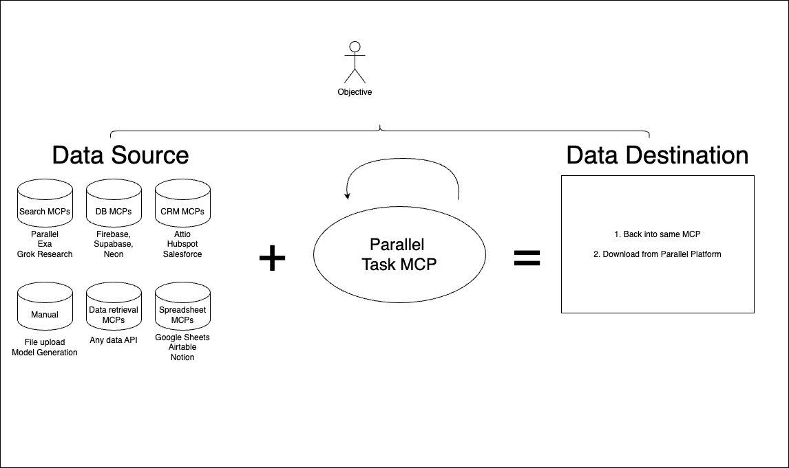

# Parallel MCP

This is a colleciton of several MCPs to work with the Parallel APIs

## [Parallel OAuth Provider](parallel-oauth-provider)

Provides MCP-compliant User Authentication into the MCPs (and potentially any other app that uses the Parallel API)

## [Task MCP](task-mcp)

Designed for tabular data enrichment, this MCP is works best together with an MCP that can get your data source.

- Demo: https://multitask-demo.parallel.ai
- MCP URL: https://multitask-demo.parallel.ai/mcp

The MCP uses https://github.com/janwilmake/with-mcp atop the openapi

## [Search MCP](search-mcp)

Adds OAuth to original [Parallel Search MCP](https://docs.parallel.ai/features/remote-mcp)

## [Sleep MCP](sleep-mcp)

Experimental tool to allow for longer tool calling time
