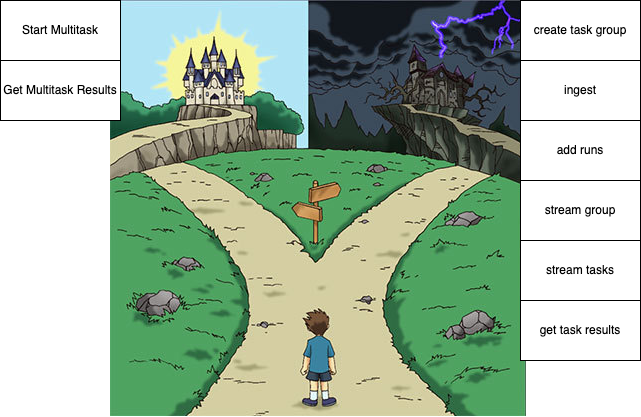

# Parallel Multitask API

The task group API of Parallel is quite a lot to take in. With the Parallel Tasks MCP, the goal is to make the Task Group API as accessible as possible through a simplified 'multitask api', basically turning a task group APIs into a single API call.

This simplification is designed to allow doing 80% of what's possible in a minimal API. For more low-level control, see https://docs.parallel.ai/

- OpenAPI Playground: https://multitask-demo.parallel.ai/openapi
- OpenAPI JSON: https://multitask-demo.parallel.ai/openapi.json
- Design SPEC (outdated): https://multitask-demo.parallel.ai/SPEC.md
- Demo: https://multitask-demo.parallel.ai
- MCP: https://mcp.openapisearch.com/multitask-demo.parallel.ai/mcp or https://multitask-demo.parallel.ai/mcp

## TODO

- ✅ initial implementation
- ✅ make mcp work via https://github.com/janwilmake/openapi-to-mcp
- add oauth using `simplerauth` returning `parallel-api-key`

OAuth

- Ensure kv doesn't create eventual consistency problems. If so, switch to DO.
- It may be easier to host this at `mcp-oauth.parallel.ai` and use in conjunction with `simplerauth-client`. This way, it's just a matter of switching the oauthHost to `mcp-oauth.parallel.ai`, and can then be used from any worker.
- Get it to work with mcp.agent-friendly.com (now having problem with cache)
- Get it to work with `npx @modelcontextprotocol/inspector`

QOL

- improve HTML and streaming behavior to be fully realtime
- make HTML mobile-friendly
- add ability to see in the title whether the task result is still loading or not (Good DX)
- add confidence and references into HTML
- show confidence as emoji in markdown
- figure out how to make it loose no functionality that doesn't increase complexity: https://letmeprompt.com/rules-httpsuithu-jza7uv0

# Parallel Tasks MCP

There are 3 components to this:

1. [Parallel Multitask API](https://github.com/janwilmake/parallel-multitask)
2. [Parallel OAuth Provider](https://github.com/janwilmake/universal-mcp-oauth/tree/main/parallel-oauth-provider) with [simplerauth-client](https://github.com/janwilmake/universal-mcp-oauth/tree/main/simplerauth-client) for MCP-compliant User Authentication
3. The MCP

MCP context:

- MCP Specification: https://uithub.com/modelcontextprotocol/modelcontextprotocol/tree/main/docs/specification/2025-06-18?lines=false
- Typescript JSON RPC methods: https://raw.githubusercontent.com/modelcontextprotocol/modelcontextprotocol/refs/heads/main/schema/2025-03-26/schema.ts or new https://uithub.com/modelcontextprotocol/modelcontextprotocol/blob/main/schema/2025-06-18/schema.ts
- with-mcp implementation: https://uithub.com/janwilmake/with-mcp/blob/main/with-mcp.ts

Other Context:

- Parallel Multitask API: https://multitask-demo.parallel.ai/openapi.json
- Parallel oauth provider url: https://oauth-demo.parallel.ai
- Simplerauth-client: https://uithub.com/janwilmake/universal-mcp-oauth/blob/main/simplerauth-client/README.md

## Consideration for sending notifications

Our goal:

- `/mcp` with single tool `multitask`: proxies to this API passing MCP request session ID as part of the webhook url
- has a `/webhook` endpoint that sends a notification back to the right session (this should be proven first to work!)

To send notifications, the connection needs to remain open with SSE. It's unclear if clients will do this for up to an hour, probably most desktop clients do, but for example, does ChatGPT does it after the chat has completed? Support may be limited. Also, this still doesn't give us the desired outcome of having the LLM respond to the task results after they're done. There are several proposals in the MCP spec that may improve the situation.

Because of this, my initial goal is to see if the current implementation can already be useful without notification. I think it does provide value as it allows for much easier task experimentation with multiple items and multiple configurations, then viewing the results in different tabs as they come back.

Nex steps:

- Test if adding `/.well-known/mcp-config` works for curlmcp. If so, ask saunack to add to https://docs.parallel.ai/features/remote-mcp.
- Add https://docs.parallel.ai/features/remote-mcp to MCP registry https://blog.modelcontextprotocol.io/posts/2025-09-08-mcp-registry-preview/
- Create demo without oauth if preferred, test output quality and ease of use
  - requires with-mcp or openapi-to-mcp to support `?apiKey` (and `.well-known/mcp-config`)
- Initial goal is to get it to work using [withMcp](https://github.com/janwilmake/with-mcp) with parallel oauth provider. This results in ability to use this within claude, chatgpt, cursor, vscode, etc etc etc and starting to add listings.
- Use same oauth provider
