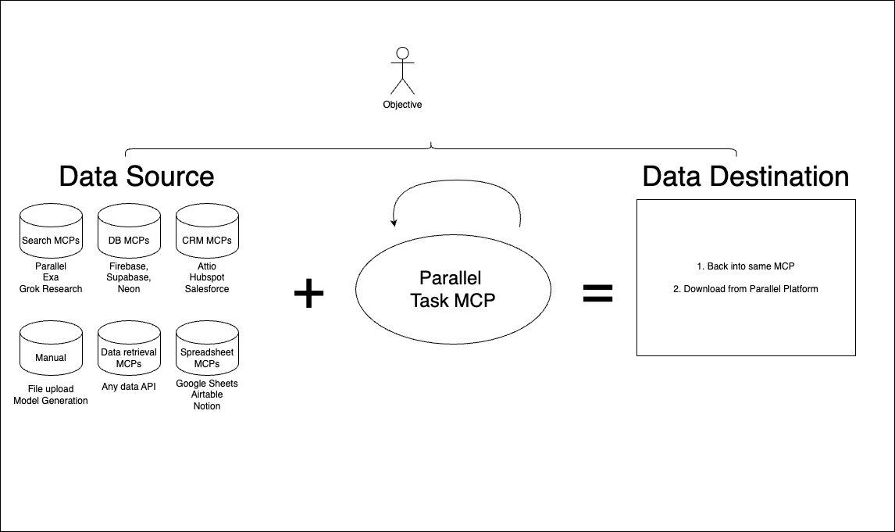

Designed for tabular data enrichment, this MCP is works best together with an MCP that can get your data source.

# Links

- OpenAPI Playground: https://task-mcp.parallel.ai/openapi
- OpenAPI JSON: https://task-mcp.parallel.ai/openapi.json
- Design SPEC (outdated): [SPEC.md](SPEC.md)
- MCP address: `https://search-mcp-proxy.parallel.ai/mcp`

# How to test MCP locally

- On localhost, run `wrangler dev --env dev`
- Run `npx @modelcontextprotocol/inspector` and test `http://localhost:8787/mcp`. The oauth flow should work.

# Context

MCP context:

- MCP Specification: https://uithub.com/modelcontextprotocol/modelcontextprotocol/tree/main/docs/specification/2025-06-18?lines=false
- Typescript JSON RPC methods: https://raw.githubusercontent.com/modelcontextprotocol/modelcontextprotocol/refs/heads/main/schema/2025-03-26/schema.ts or new https://uithub.com/modelcontextprotocol/modelcontextprotocol/blob/main/schema/2025-06-18/schema.ts
- with-mcp implementation: https://uithub.com/janwilmake/with-mcp/blob/main/with-mcp.ts

Other Context:

- Parallel Multitask API: https://task-mcp.parallel.ai/openapi.json
- Parallel oauth provider url: https://oauth-demo.parallel.ai
- Simplerauth-client: https://uithub.com/janwilmake/universal-mcp-oauth/blob/main/simplerauth-client/README.md
