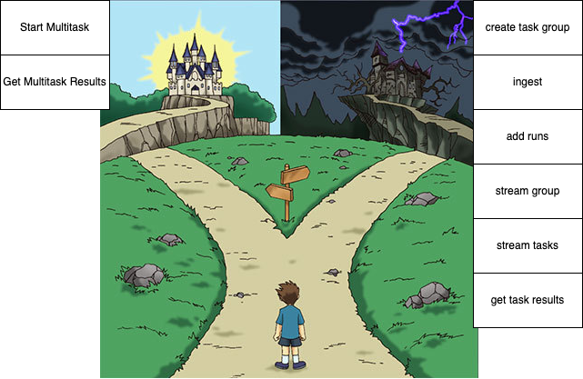

The task group API of Parallel is quite a lot to take in. With the Parallel Multitask API, the goal is to make the Task Group API as accessible as possible through a simplified 'multitask api', basically turning a task group APIs into a single API call.

This simplification is designed to allow doing 80% of what's possible in a minimal API that allows a simple minimal interface to the entire workflow of the task group API suite. This type of minimal interface is ideal for use with MCP as also [advocated by Vercel](https://vercel.com/blog/the-second-wave-of-mcp-building-for-llms-not-developers#performance-improvements-with-workflow-tools), but it's also great for making it easier to build powerful apps on top of the Task Group API. For more low-level control, see https://docs.parallel.ai/



- OpenAPI Playground: https://task-mcp.parallel.ai/openapi
- OpenAPI JSON: https://task-mcp.parallel.ai/openapi.json
- Design SPEC (outdated): https://task-mcp.parallel.ai/SPEC.md

# MCP Server Installation Guide

**Server Name**: `Parallel Task MCP`  
**Server URL**: `https://task-mcp.parallel.ai/mcp`

## Cursor

[🔗 Install via deep link](https://cursor.com/en/install-mcp?name=Parallel%20Task%20MCP&config=eyJ1cmwiOiJodHRwczovL3Rhc2stbWNwLnBhcmFsbGVsLmFpL21jcCJ9)

**Instructions:** Add to `~/.cursor/mcp.json` or `.cursor/mcp.json` (project-specific)

**Configuration:**

```json
{
  "mcpServers": {
    "Parallel Task MCP": {
      "url": "https://task-mcp.parallel.ai/mcp"
    }
  }
}
```

---

## VS Code

[🔗 Install via deep link](https://insiders.vscode.dev/redirect/mcp/install?name=Parallel%20Task%20MCP&config=%7B%22type%22%3A%22http%22%2C%22url%22%3A%22https%3A%2F%2Ftask-mcp.parallel.ai%2Fmcp%22%7D)

**Instructions:** Add to VS Code settings.json

**Configuration:**

```json
{
  "mcp": {
    "servers": {
      "Parallel Task MCP": {
        "type": "http",
        "url": "https://task-mcp.parallel.ai/mcp"
      }
    }
  }
}
```

---

## Claude.ai

**Instructions:** Go to https://claude.ai/settings/connectors and select 'add custom connector'. Fill in:

- **Name**: Parallel Task MCP
- **URL**: https://task-mcp.parallel.ai/mcp

---

## ChatGPT.com

**Instructions:** First, go to 'Settings -> Connectors -> Advanced Settings' and turn on 'Developer Mode'.

Then, in connector settings click 'create'.

Fill in:

- **Name**: Parallel Task MCP
- **URL**: https://task-mcp.parallel.ai/mcp
- **Authentication**: OAuth

In a new chat ensure developer mode is turned on with the connector(s) selected.

---

## Claude Code

**Command:**

```bash
claude mcp add --transport http Parallel Task MCP https://task-mcp.parallel.ai/mcp
```

**Instructions:** Run the command in your terminal

---

## Windsurf

**Instructions:** Add to your Windsurf MCP configuration

**Configuration:**

```json
{
  "mcpServers": {
    "Parallel Task MCP": {
      "serverUrl": "https://task-mcp.parallel.ai/mcp"
    }
  }
}
```

---

## Cline

**Instructions:** Go to MCP Servers section → Remote Servers → Edit Configuration

**Configuration:**

```json
{
  "mcpServers": {
    "Parallel Task MCP": {
      "url": "https://task-mcp.parallel.ai/mcp",
      "type": "streamableHttp"
    }
  }
}
```

---

## Gemini CLI

**Instructions:** Add to `~/.gemini/settings.json`

**Configuration:**

```json
{
  "mcpServers": {
    "Parallel Task MCP": {
      "httpUrl": "https://task-mcp.parallel.ai/mcp"
    }
  }
}
```

---

## Claude Desktop

**Instructions:** Go to Settings → Connectors → Add Custom Connector and fill in:

- **Name**: Parallel Task MCP
- **URL**: https://task-mcp.parallel.ai/mcp

# How to test MCP locally

- On localhost, run `wrangler dev --env dev`
- Run `npx @modelcontextprotocol/inspector` and test `http://localhost:8787/mcp`. The oauth flow should work.

# Context

MCP context:

- MCP Specification: https://uithub.com/modelcontextprotocol/modelcontextprotocol/tree/main/docs/specification/2025-06-18?lines=false
- Typescript JSON RPC methods: https://raw.githubusercontent.com/modelcontextprotocol/modelcontextprotocol/refs/heads/main/schema/2025-03-26/schema.ts or new https://uithub.com/modelcontextprotocol/modelcontextprotocol/blob/main/schema/2025-06-18/schema.ts
- with-mcp implementation: https://uithub.com/janwilmake/with-mcp/blob/main/with-mcp.ts

Other Context:

- Parallel Multitask API: https://task-mcp.parallel.ai/openapi.json
- Parallel oauth provider url: https://oauth-demo.parallel.ai
- Simplerauth-client: https://uithub.com/janwilmake/universal-mcp-oauth/blob/main/simplerauth-client/README.md
